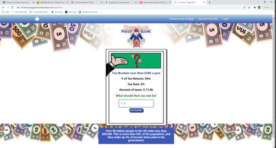

# Uncle Sam's Piggy Bank - Federal Budget React App

## Description:

Coding project to develop an app to allow a user to modify the federal budget by changing the percentage of collected taxes and change federal department expenses to see if they can do a better job at balancing the federal budget than the government. Budget info was collected from the federal budget website for 2020.

> ## Table of Contents

- [Installation](#installation)
- [Usage](#usage)
- [Contributing](#contributing)
- [Tests](#tests)
- [Questions](#questions)

## Installation:

To install necessary dependencies run the following command:

> npm i

## Usage Information:

Website can be viewed on deployed URL by clicking the screenshot below.

> 

## Contributing Information:

Please contact our group if you would like to learn more about our project.

## Tests:

To run tests, run the following command:

> n/a

## Questions:

---

> Creator Github account: [Kasey Raymond](https://api.github.com/users/KcRaymond)

> Email Creator: [kaseyleigh1978@gmail.com](mailto:)
